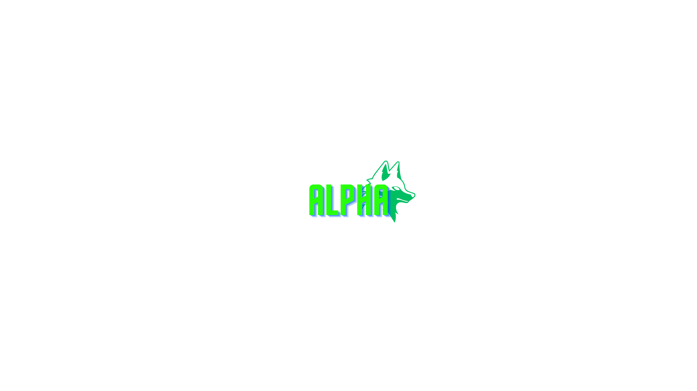
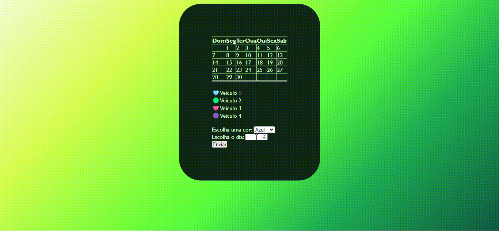

# Calendario

## Propósta da empresa
uma empresa de entregas chamada "Alpha" que tem como propósito 
fazer entregas rápidas para a satisfação de nossos clientes 

## Descrição do site
No site é possivel você escolher a data de entrega do seu produto 
em até um mês, é possivel fazer em até 3 entregas por carro, 
não é possivel marcar mais de 1 entrega no mesmo dia 

## Design do site
A escolha de design do site foi feita por designers profissionais 

## Logo da empresa

## Logo da empresa

## imagem do site

# Tecnologias utilizadas 
*`HTML5` 
*`CSS3` 
*`Git` 
*`Github` 
*`Javascript` 

## Ferramentas utilizadas 
* `VScode` 

## Matérias utilizadas para a produção do site
Programação Web 1: 
Professor [Leonardo](https://github.com/leonardorochamarista) 

## Linkedin do desenvolvedor
[Meu perfil no linkedin](https://www.linkedin.com/in/eric-mendes-moreira-b5a49b301/)
