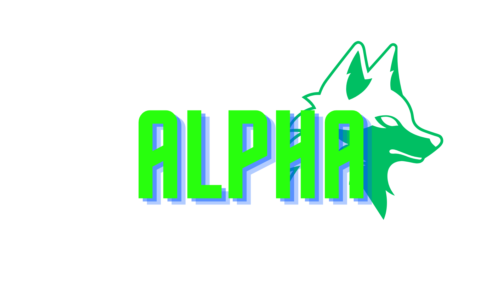

# Calendario

## Logo da empresa

## imagem do site

# Tecnologias utilizadas 
*`HTML5` 
*`CSS3` 
*`Git` 
*`Github` 
*`Javascript` 

## Ferramentas utilizadas 
* `VScode` 

## Matérias utilizadas para a produção do site
Programação Web 1: 
Professor [Leonardo](https://github.com/leonardorochamarista) 
